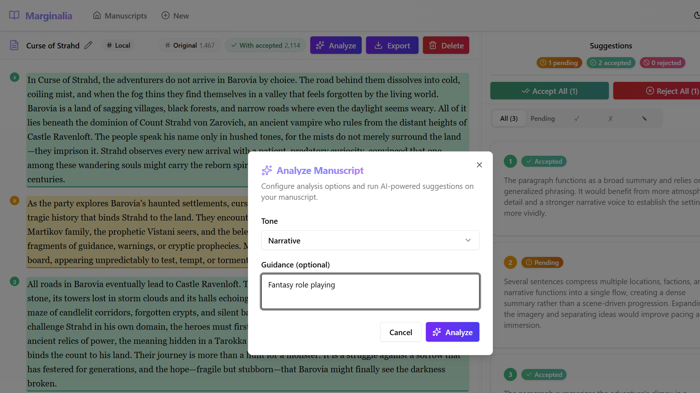
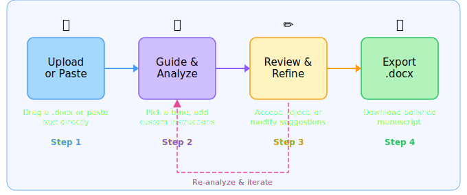

# Marginalia

[![CI][ci-shield]][ci-url]
[![CD][cd-shield]][cd-url]
[![License: MIT][license-shield]][license-url]
[![.NET 10][dotnet-shield]][dotnet-url]
[![Node.js 22+][node-shield]][node-url]
[![TypeScript][ts-shield]][ts-url]
[![React 19][react-shield]][react-url]
[![Azure][azure-shield]][azure-url]
[![GitHub Issues][issues-shield]][issues-url]
[![PRs Welcome][prs-shield]][prs-url]
[![GitHub Stars][stars-shield]][stars-url]

> *Your manuscript deserves more than a spell-checker.*

Marginalia is an AI-powered editorial assistant for long-form writers. Upload a Word document or paste your draft, describe what you want improved, and let AI analyze your prose paragraph by paragraph — surfacing compressed narrative, inconsistent tone, awkward repetition, and opportunities for expansion. Review every suggestion with full rationale, accept or reject with a click, steer the AI with your own instructions, then export a polished `.docx` — all without losing your voice.



## How It Works



1. **Upload or Paste** — Drag-and-drop a `.docx` file or paste text directly. Marginalia splits your document into paragraphs for focused analysis.
1. **Guide & Analyze** — Write custom instructions, pick a tone (Professional, Narrative, Academic, Conversational, or Literary), and hit *Analyze*. The AI reviews your text and returns suggestions with clear rationale for each.
1. **Review & Refine** — Suggestions appear in a resizable side panel, color-coded by status. Accept, reject, or modify each one. Accepting a suggestion for a paragraph automatically rejects competing alternatives. Re-analyze individual paragraphs or the entire document at any time.
1. **Export** — Download your revised manuscript as a Word document with all accepted changes applied.

## Quick Start

For full setup instructions, see [docs/QUICKSTART-LOCAL.md](docs/QUICKSTART-LOCAL.md). To deploy to Azure, see [docs/QUICKSTART-AZURE.md](docs/QUICKSTART-AZURE.md).

### Prerequisites

- [.NET 10 SDK](https://dotnet.microsoft.com/download/dotnet/10.0)
- [Node.js 22+](https://nodejs.org/) and [pnpm](https://pnpm.io/installation)
- [.NET Aspire workload](https://learn.microsoft.com/dotnet/aspire/) — `dotnet workload install aspire`
- [Azure CLI](https://learn.microsoft.com/cli/azure/install-azure-cli) with an Azure account (free tier works)

### Run Locally

```bash
git clone https://github.com/marymacgregorreid/marginalia.git
cd marginalia
az login
aspire run
```

Aspire provisions a local Cosmos DB emulator and connects to your AI Foundry endpoint, then starts the backend API and Vite dev server. Open <http://localhost:5173> to begin editing.

For troubleshooting, credential configuration, and model overrides, see [Local Development](docs/QUICKSTART-LOCAL.md).

## Documentation

| Document | Description |
| --- | --- |
| [User Guide](docs/USER-GUIDE.md) | Step-by-step walkthrough with screenshots |
| [Local Development](docs/QUICKSTART-LOCAL.md) | Local dev setup, Azure credentials, first-run walkthrough, and troubleshooting |
| [Deploy to Azure](docs/QUICKSTART-AZURE.md) | Azure Developer CLI deployment and infrastructure provisioning |
| [Product Requirements](docs/design/PRD.md) | Original product requirements document |

## Features

### Editorial Intelligence

- **Paragraph-level AI analysis** powered by Azure AI Foundry — identifies compressed narrative, stylistic drift, repetitive structures, and expansion opportunities.
- **Transparent rationale** — every suggestion explains *why*, not just *what*.
- **Tone guidance** — five built-in tone profiles plus free-form written instructions.
- **Iterative refinement** — re-analyze individual paragraphs with surrounding context, or the full document with accepted edits merged in.

### Writer-First Workflow

- **Accept / Reject / Modify** — full control over every suggestion. Modify lets you steer the AI's output with your own text.
- **Exclusive acceptance** — accepting one suggestion for a paragraph auto-rejects the others, keeping your decisions clean.
- **Batch actions** — bulk accept or reject suggestions by status filter.
- **Document management** — rename, delete, and browse all your documents from the home page.

### Polished Experience

- **Resizable split layout** — drag the divider between the editor and suggestion panel to suit your screen.
- **Dark and light themes** — toggle in the header; persists across sessions.
- **Status-coded highlights** — amber (pending), emerald (accepted), rose (rejected), sky (modified) in both the editor and suggestion cards.
- **Word import & export** — upload `.docx`, export `*-revised.docx` with formatting preserved.
- **Accessibility** — jest-axe tested components, color + icon status indicators (never color-only).

### Built for Flexibility

- **Bring Your Own Model** — configure any compatible Foundry endpoint and model, or use Entra ID authentication.
- **Access code protection** — optionally gate the app behind an access code for single-user deployments.
- **LLM health check** — verify your AI endpoint connection from the settings dialog.
- **OpenTelemetry** — full observability for both frontend and backend via .NET Aspire.

## Tech Stack

| Layer | Technology |
| --- | --- |
| Frontend | React 19, TypeScript, Vite, Tailwind CSS v4, shadcn/ui, Lucide icons |
| Backend | .NET 10, ASP.NET Core, Clean Architecture |
| AI | Azure AI Foundry (Microsoft.Extensions.AI), configurable model |
| Database | Azure Cosmos DB (partitioned by user) |
| Orchestration | .NET Aspire (local dev & cloud) |
| Infrastructure | Azure Bicep, Azure Developer CLI |

## Roadmap

- [ ] Google Docs import and export
- [ ] OneDrive integration
- [ ] Multi-language manuscript support
- [ ] Collaborative multi-user editing

## License

MIT

<!-- Badge reference links -->
[ci-shield]: https://img.shields.io/github/actions/workflow/status/marymacgregorreid/marginalia/continuous-integration.yml?branch=main&label=CI
[ci-url]: https://github.com/marymacgregorreid/marginalia/actions/workflows/continuous-integration.yml
[cd-shield]: https://img.shields.io/github/actions/workflow/status/marymacgregorreid/marginalia/continuous-delivery.yml?branch=main&label=CD
[cd-url]: https://github.com/marymacgregorreid/marginalia/actions/workflows/continuous-delivery.yml
[license-shield]: https://img.shields.io/badge/license-MIT-blue.svg
[license-url]: https://github.com/marymacgregorreid/marginalia/blob/main/LICENSE
[dotnet-shield]: https://img.shields.io/badge/.NET-10-512bd4?logo=dotnet
[dotnet-url]: https://dotnet.microsoft.com/download/dotnet/10.0
[node-shield]: https://img.shields.io/badge/Node.js-22%2B-5fa04e?logo=nodedotjs
[node-url]: https://nodejs.org/
[ts-shield]: https://img.shields.io/badge/TypeScript-5-3178c6?logo=typescript&logoColor=white
[ts-url]: https://www.typescriptlang.org/
[react-shield]: https://img.shields.io/badge/React-19-61dafb?logo=react&logoColor=white
[react-url]: https://react.dev/
[azure-shield]: https://img.shields.io/badge/Azure-Deployed-0078d4?logo=microsoftazure&logoColor=white
[azure-url]: https://azure.microsoft.com/
[issues-shield]: https://img.shields.io/github/issues/marymacgregorreid/marginalia
[issues-url]: https://github.com/marymacgregorreid/marginalia/issues
[prs-shield]: https://img.shields.io/badge/PRs-welcome-brightgreen.svg
[prs-url]: https://github.com/marymacgregorreid/marginalia/pulls
[stars-shield]: https://img.shields.io/github/stars/marymacgregorreid/marginalia?style=flat
[stars-url]: https://github.com/marymacgregorreid/marginalia/stargazers

---

<details>
<summary><strong>Specification</strong> — Full technical requirements and data model.</summary>

## Specification

### Functional Requirements

#### Document Ingestion & Management

- Upload Microsoft Word documents (`.docx`, up to 50 MB) from the local machine.
- Paste text directly into the editor as an alternative to file upload.
- Split documents into paragraphs for focused, paragraph-level analysis.
- Rename and delete documents from the home page.

#### Guidance & Control

- Let the author specify areas for improvement (e.g., compressed narrative, AI-like writing, lack of color).
- Enable authors to provide custom written instructions per analysis run.
- Present the option to choose a desired tone (Professional, Narrative, Academic, Conversational, Literary) or provide free-form guidance.

#### Suggestion Engine

- Analyze the given text paragraph by paragraph, highlighting passages where:
  - The narrative may be overly compressed.
  - Style is inconsistent or "AI-like."
  - Repetitive or awkward prosaic structures are found.
  - Additional narrative detail or expansion could be beneficial.
- Provide AI-generated suggestions with rationale for each.
- Allow batch or individual acceptance/rejection of suggestions.
- Enable users to modify or further steer the AI's suggestions before applying.
- Accepting a suggestion for a paragraph auto-rejects competing alternatives.
- Re-analyze individual paragraphs (with surrounding context) or the full document with accepted edits merged in.

#### User Interface

- Display text with visually distinct, color-coded highlights for suggested areas (amber, emerald, rose, sky).
- Show suggestion rationale in a resizable side panel.
- Filter suggestions by status (All, Pending, Accepted, Rejected, Modified).
- Dark and light theme toggle with persistent preference.
- Apply selected changes to the document, maintaining original formatting where possible.

#### Export & Save

- Export revised document locally as a Word file (`.docx`) with accepted suggestions applied.
- Google Docs import/export (planned — not yet implemented).

### Non-Functional Requirements

- Optional access code protection for single-user deployments.
- Reliable file handling for local document imports/exports.
- Responsive and user-friendly interface.
- Accessible UI tested with jest-axe; status indicators use color + icon.
- Full OpenTelemetry observability for frontend and backend.

### Tech Stack

- **Frontend**: React 19, Vite, TypeScript (strict mode), Tailwind CSS v4, shadcn/ui (New York style), Lucide icons
- **Backend**: .NET 10, ASP.NET Core Web API, Clean Architecture
- **Database**: Azure Cosmos DB with `/userId` partition key (multi-tenant by user)
- **AI**: Azure AI Foundry via Microsoft.Extensions.AI `IChatClient`, configurable model endpoint
- **Infrastructure**: Azure Bicep, .NET Aspire orchestration, Azure Developer CLI

### Architecture Overview

#### Client-Server Model

- React frontend for UI, text highlighting, and direct user interaction.
- Backend APIs handle file uploads, document parsing, session management, and AI orchestration.
- Integration with Azure AI Foundry for text analysis and suggestion generation.
- Cosmos DB persistence for documents and sessions, partitioned by user.
- .NET Aspire manages local development and cloud orchestration.

#### Backend Structure (Clean Architecture)

- `Domain/` — Core models (Document, Paragraph, Suggestion, UserSession), interfaces, and enums with zero external dependencies.
- `Api/` — ASP.NET Core endpoints for file uploads, document analysis, suggestion management, and configuration.
- `Infrastructure/` — Service implementations for Word document processing, AI integration, and Cosmos DB repositories.
- Shared build configuration via `Directory.Build.props` and `Directory.Packages.props`.

#### Frontend Structure

- `src/components/` — UI components organized by domain (document editor, suggestion panel, upload, export).
- `src/hooks/` — Custom hooks for state management (`useDocument`, `useSuggestions`, `useAnalysis`, `useLlmConfig`, `useTheme`, `useAccessCode`).
- `src/services/` — Typed API client layer with centralized error handling.
- `src/types/` — TypeScript type definitions mirroring backend models.

### Data Model

#### Document

- `id` — Unique identifier
- `userId` — Owner identifier (from `X-User-Id` header)
- `filename` — Original filename
- `title` — Editable document title
- `source` — Origin (Local or GoogleDocs)
- `status` — Draft or Analyzed
- `paragraphs[]` — Array of paragraph objects with id and text
- `suggestions[]` — Array of associated suggestions

#### Suggestion

- `id` — Unique identifier
- `documentId` — Foreign key to Document
- `paragraphId` — Foreign key to paragraph within the document
- `rationale` — Explanation for the suggestion
- `proposedChange` — Suggested replacement text
- `status` — Pending, Accepted, Rejected, or Modified
- `userSteeringInput` — Author's custom feedback or modified text

#### UserSession

- `id` — Unique identifier
- `userId` — Owner identifier
- `documentIds[]` — Documents opened in this session
- `createdAt` / `updatedAt` — Timestamps

### External Integrations

- **Azure AI Foundry** — For AI-powered text analysis and suggestion generation. Supports Entra ID or API key authentication.
- **Google Docs API** — Planned for importing/exporting documents (not yet implemented).
- **OpenXML SDK** — For Word document parsing and export with formatting preservation.

### Constraints & Assumptions

- Maximum document chunk size is approximately 3 pages (~6,000 characters) per analysis to maintain responsiveness.
- Minimal authentication — BYO model pattern via LLM endpoint configuration; optional access code.
- Internet connection required for AI processing.
- Original formatting and footnotes use best-effort preservation.
- Designed for English-language manuscripts.
- Accepted suggestions are merged into paragraph text during re-analysis to preserve edits.

</details>
