# Marginalia User Guide

Marginalia is an AI-powered manuscript analysis tool that helps writers improve
their work through intelligent suggestions. This guide walks you through the
full workflow: creating a manuscript, analyzing it, and reviewing suggestions.

## Getting Started

When you first open Marginalia, you see the **Your Manuscripts** page. This is
your home screen where all saved manuscripts are listed. If you have no
manuscripts yet, you will see an empty state prompting you to create one.

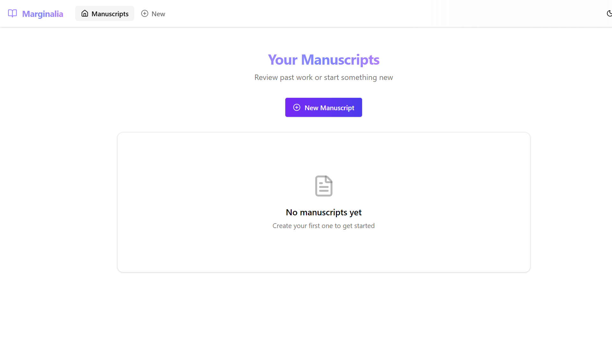

## Creating a New Manuscript

1. Click the **New Manuscript** button on the home page, or select the **New**
   tab in the navigation bar.

You are presented with two options for adding content:

- **Upload a Word document** (.docx) by dragging and dropping into the upload
  zone or clicking to browse.
- **Paste text** directly using the paste text mode.

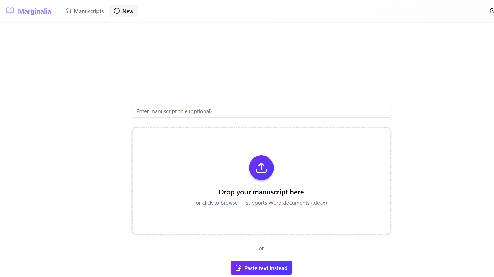

### Using Paste Mode

1. Enter a title for your manuscript in the **Manuscript title** field.
1. Click the **Paste text instead** button below the upload zone.

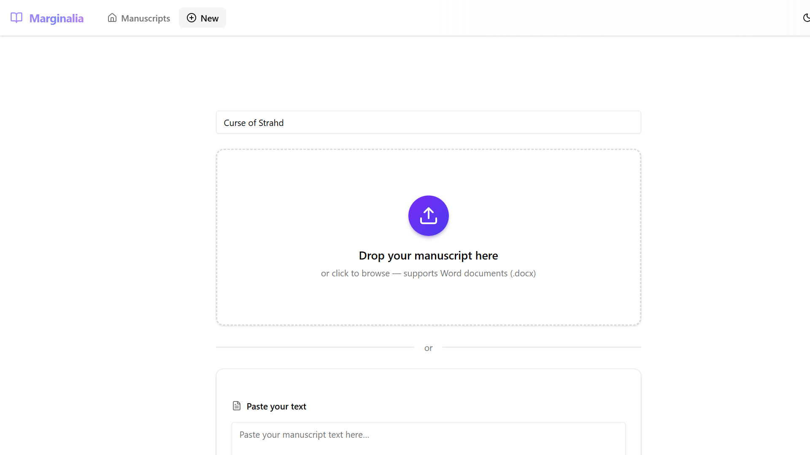

1. Paste or type your manuscript text into the text area.
1. Click the **Load Text** button to import the text.

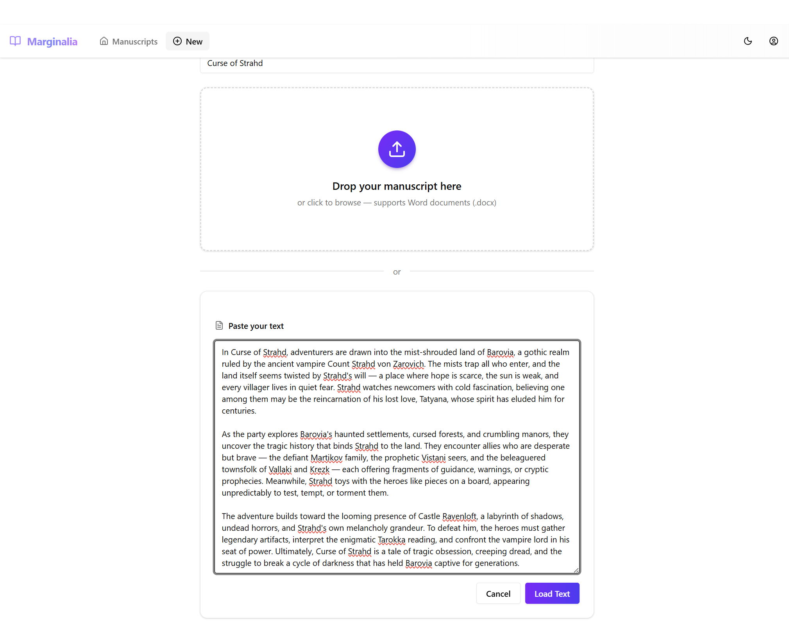

## The Editor

After loading your text, Marginalia opens the **Editor** view. The editor
displays:

- **Toolbar** — shows the manuscript title, source label, original and accepted
  word counts, and action buttons (Analyze, Export, Delete).
- **Document pane** (left) — your manuscript text, divided into paragraphs.
- **Suggestions panel** (right) — where AI suggestions appear after analysis.

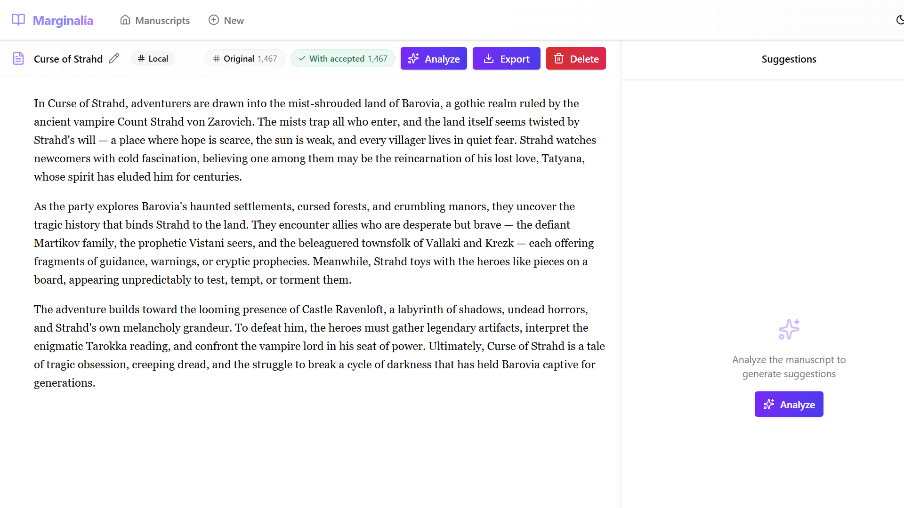

## Analyzing Your Manuscript

1. Click the **Analyze** button in the toolbar. The **Analyze Manuscript**
   dialog opens.

1. Select a **Tone** from the dropdown. Available tones include Professional,
   Narrative, Academic, Conversational, and Literary.
1. Optionally enter **Guidance** to focus the analysis on specific aspects of
   your writing.

In this example, we select **Narrative** tone and enter "Fantasy role playing"
as guidance.

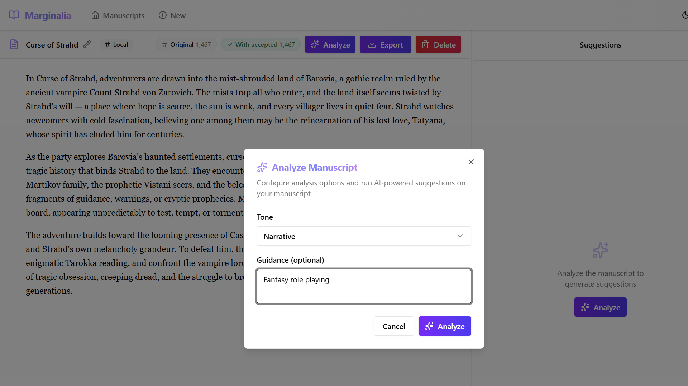

1. Click **Analyze** to start the AI analysis. A progress indicator shows while
   the analysis runs.

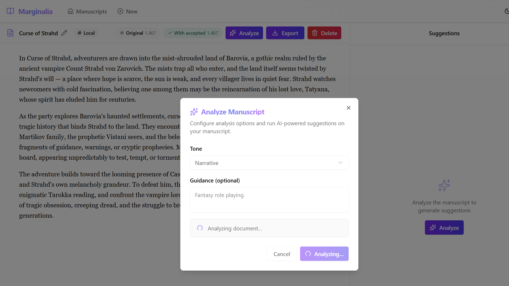

## Reviewing Suggestions

Once the analysis completes, suggestions appear in the right panel. Each
suggestion is linked to a paragraph in your manuscript, indicated by numbered
markers in the document.

The suggestions panel shows:

- **Summary counts** — pending, accepted, and rejected suggestions.
- **Bulk actions** — Accept All and Reject All buttons.
- **Filter tabs** — All, Pending, Accepted (check mark), Rejected (X), and
  Modified (pencil).
- **Individual suggestion cards** — each showing the paragraph number, status,
  and a summary of the feedback.

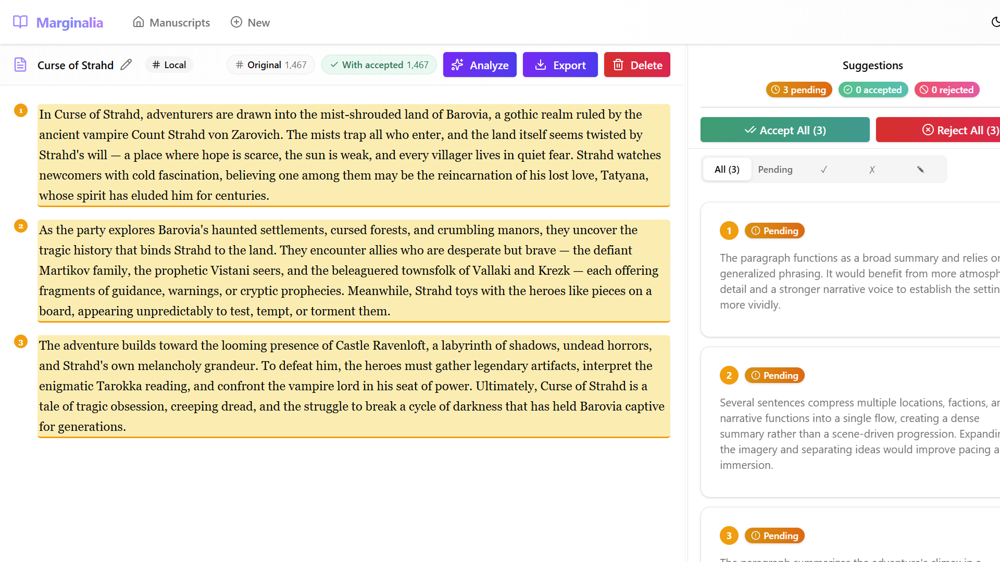

### Expanding a Suggestion

Click a suggestion card or its expand arrow to see the full details:

- **Original text** — the current paragraph text (shown with strikethrough).
- **Proposed change** — the AI-recommended replacement text.
- **Action buttons** — Accept, Reject, Modify, or re-Analyze.

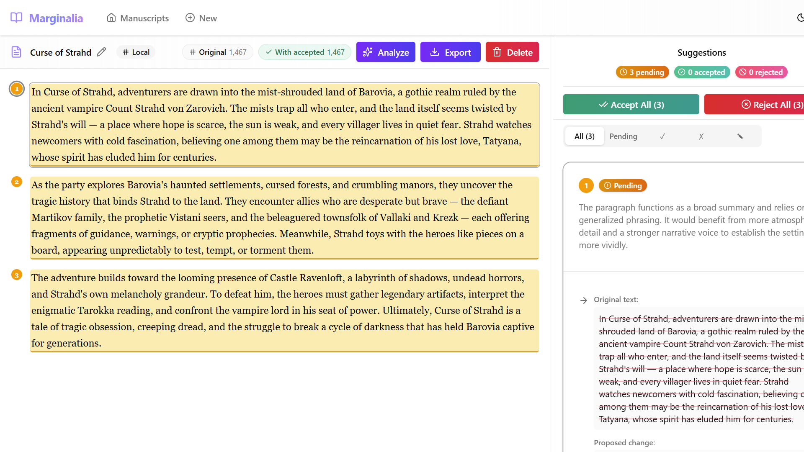

### Accepting a Suggestion

Click **Accept** on a suggestion to apply the proposed change. The document
text updates immediately to reflect the accepted revision, and the word count
adjusts in the toolbar.

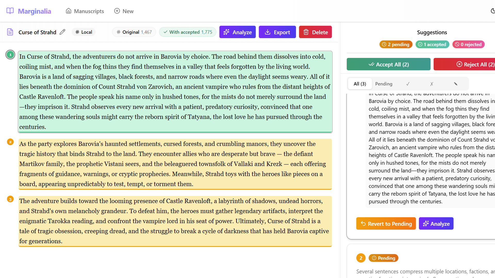

You can accept multiple suggestions individually. In this example, suggestions 1
and 3 have been accepted while suggestion 2 remains pending.

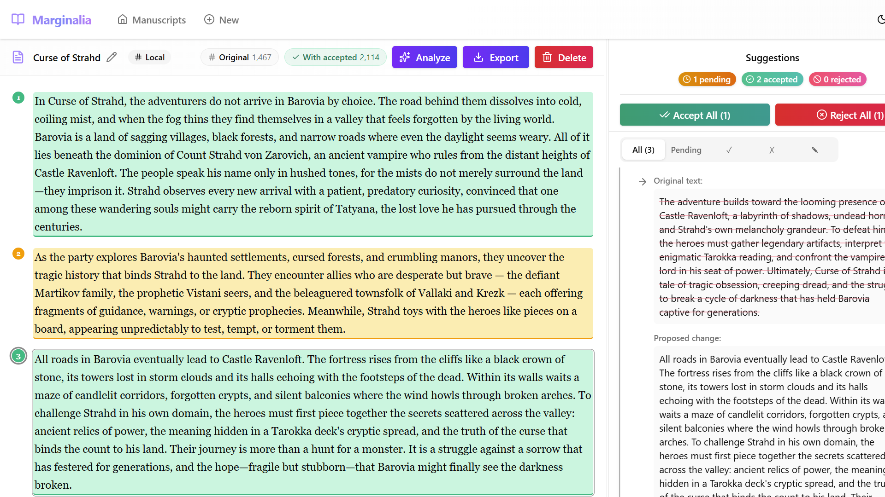

### Other Suggestion Actions

- **Reject** — dismisses the suggestion without changing the text.
- **Modify** — lets you edit the proposed text before applying it.
- **Revert to Pending** — undoes an accept or reject, returning the suggestion
  to pending status.
- **Analyze** — re-runs the analysis on just that paragraph.

## Re-Analyzing a Manuscript

You can run a fresh analysis on a manuscript that already has suggestions. This
is useful when you have accepted some suggestions and want new feedback on the
updated text.

1. Open the manuscript in the editor. In this example, 2 suggestions have been
   accepted and 1 is still pending.

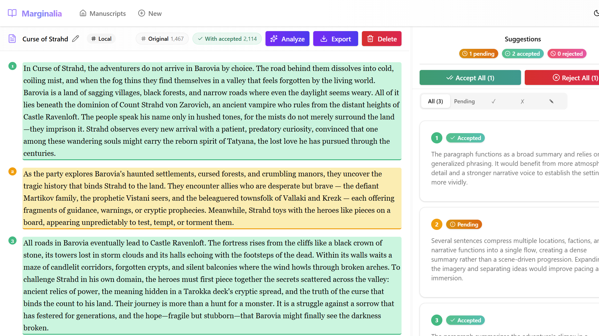

1. Click **Analyze** in the toolbar. The Analyze Manuscript dialog opens,
   allowing you to choose a new tone and guidance.

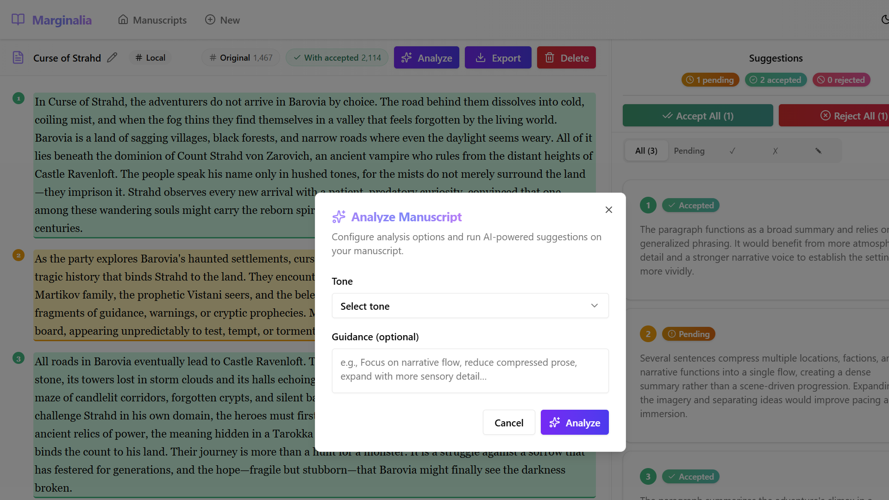

1. Configure the tone and guidance as desired, then click **Analyze**.

1. Because the manuscript was analyzed before, a **Replace Analysis?**
   confirmation dialog appears. It explains that your accepted suggestions will
   be merged into the manuscript text and any pending suggestions will be
   discarded.

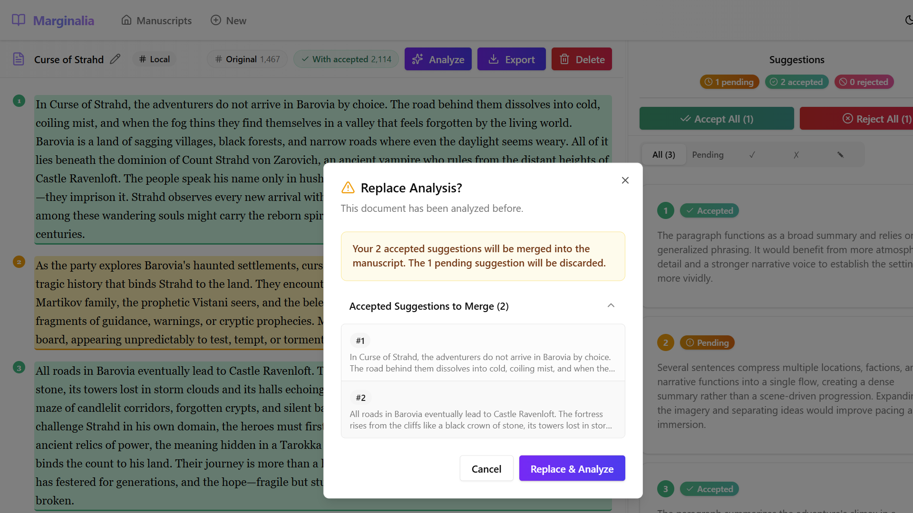

1. Click **Replace & Analyze** to proceed. The accepted changes become part of
   the base text, and a new set of suggestions is generated.

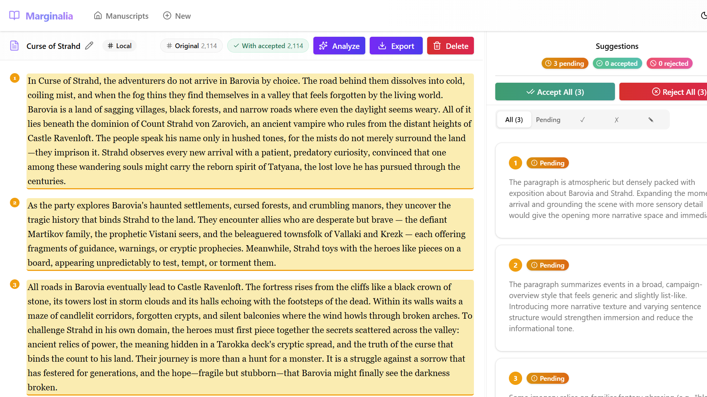

The original word count now reflects the merged text, and all suggestions start
fresh in the pending state.

## Analyzing a Single Paragraph

Instead of re-analyzing the entire manuscript, you can re-analyze a single
paragraph from within an expanded suggestion. This lets you try different tone
and guidance settings on just one section.

1. Expand a suggestion by clicking its card or the expand arrow.

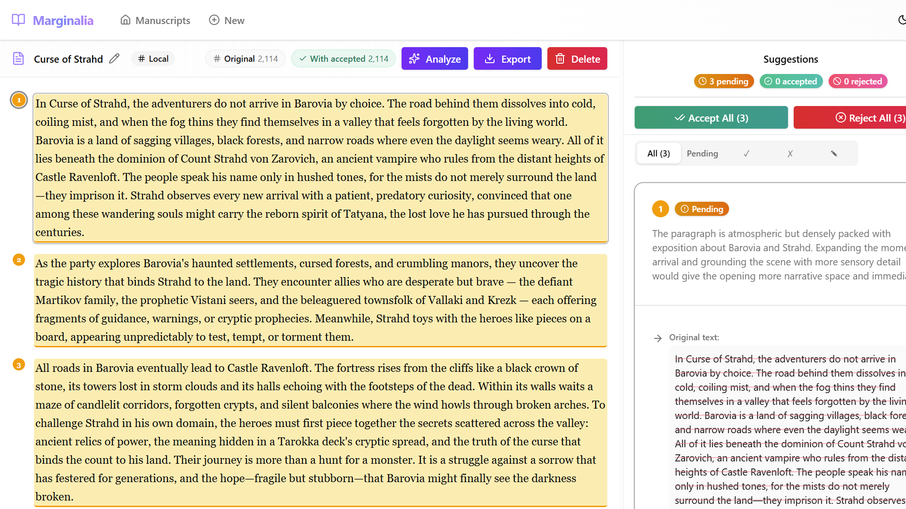

1. Click the **Analyze** button at the bottom of the expanded suggestion. The
   **Analyze Paragraph** dialog opens, pre-populated with the settings from the
   last analysis.

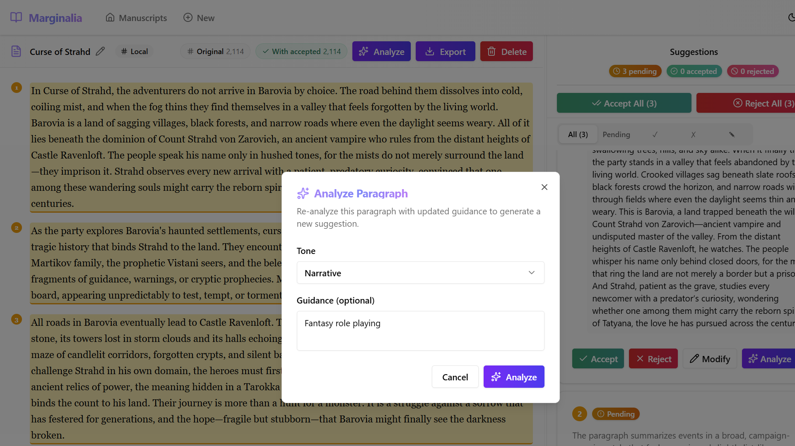

1. Change the tone and guidance to explore a different editorial direction. In
   this example, we switch to **Conversational** tone and enter "Childrens
   story" as guidance.

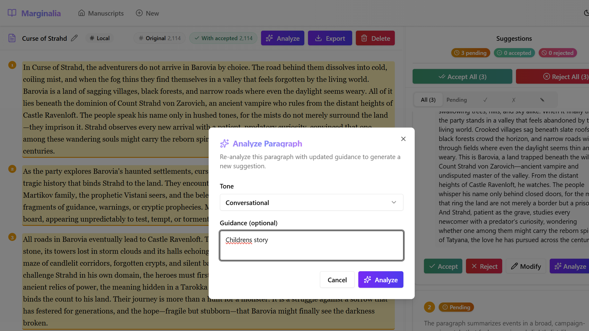

1. Click **Analyze**. A new suggestion is generated for just that paragraph and
   added alongside the existing suggestions. The paragraph now shows multiple
   suggestion markers, and the suggestion count increases.

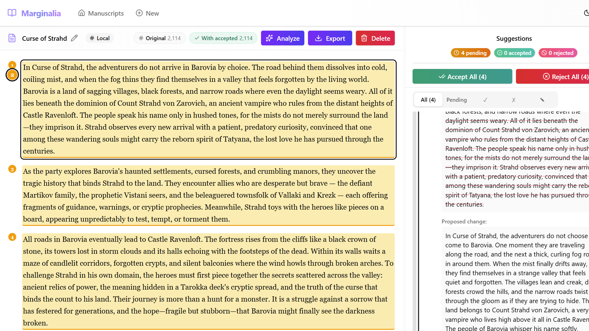

You can repeat this process with different tones and guidance to compare multiple
editorial perspectives for the same paragraph.

## Managing Manuscripts

After analysis, your manuscript appears in the manuscript list on the home page,
showing the title, date, suggestion count, and analysis status.

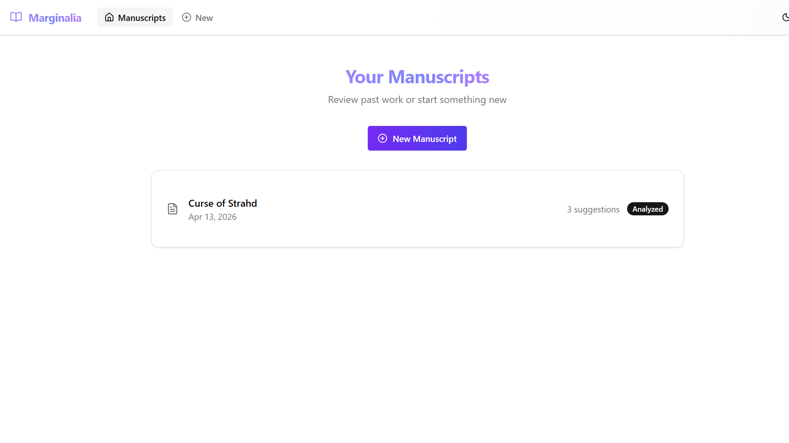

From the editor toolbar you can also:

- **Export** — download the manuscript with accepted changes applied.
- **Delete** — remove the manuscript from your library.
